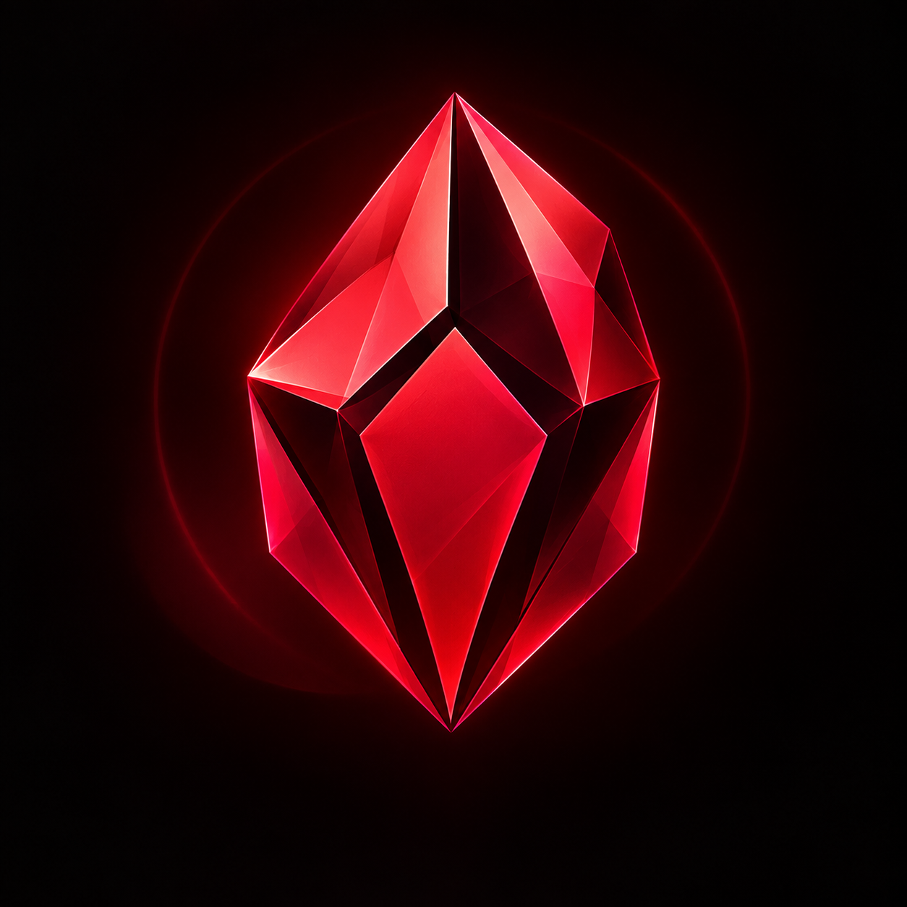

# Crimson Notepad

<p align="center">
  
</p>

<h3 align="center">
A lightweight Markdown notebook built for instant access.
</h3>

<p align="center">
Write less. Switch less. Focus more.
</p>

---

## Why Crimson Exists

While studying, researching, or coding, important roadmaps and notes often end up buried inside:

- ChatGPT conversations
- Browser tabs
- PDFs
- Large note-taking applications

Every time you need to reference them, you break your flow.

Crimson Notepad was created to solve one simple problem:

> Your notes should always be one shortcut away.

Press a shortcut.

Read your note.

Continue your work.

No tab switching.
No workspace loading.
No distractions.

---

## Philosophy

Crimson is **not** trying to replace Obsidian.

Crimson is **not** trying to become a second brain.

Crimson is designed around one idea:

> Fast access beats complex organization.

---

## Features

### Core

- Markdown (.md) support
- Local-first storage
- Lightweight and fast
- Dark Crimson theme
- Auto-save
- Simple note management

### Productivity

- Global shortcut
- System tray support
- Instant note access
- Search notes
- Recent notes

### Study Features

- Mermaid diagrams
- Checklists
- Code blocks
- Tables
- Reading mode

### Future

- Overlay mode
- Quick note launcher
- Note templates
- Auto updates

---

## Example Workflow

### Traditional Workflow

```text
Study
↓
Need roadmap
↓
Open browser
↓
Find ChatGPT conversation
↓
Scroll
↓
Read roadmap
↓
Return to study